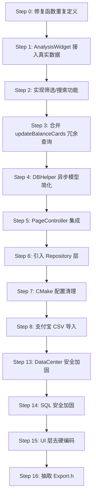

# BookKeeping Project Instructions

## Project Goal

A Qt6 + C++17 + SQLite3 desktop accounting app with clean three-layer architecture.
Primary goal: reliable data storage and intuitive expense/income tracking.
Secondary goal: maintainable codebase that supports future feature additions.

## Tech Stack

| Component | Detail |
|-----------|--------|
| Language  | C++17 |
| UI        | Qt6 (Widgets + Charts) |
| Database  | SQLite3 via sqlite_modern_cpp |
| Build     | CMake 3.22+, MSVC 2022 |
| Encoding  | UTF-8 (compile flag /utf-8) |

## Architecture

```
MainApp.exe (entry)
  ├─ MyWindow.dll (UI layer, Mediator pattern)
  └─ DataCenter.dll (data layer, Facade pattern)
       └─ sqlite3
       └─ TradeRecord.h (pure model, zero dependencies)
Tests/DataCenterTest.exe (console, no GUI needed)
  └─ DataCenter.dll
```

### Layer Rules

- UI Layer (MyWindow): layout, signals, user interaction. Never access database directly.
- Data Layer (DataCenter): all business logic + database access. Never include UI headers.
- Model (TradeRecord.h): pure data structures only. No business logic, no database code.

## Code Style

### Naming

| Category   | Style       | Examples |
|----------- |-------------|----------|
| Class      | PascalCase  | MainWidget, AccountingWidget |
| Function   | camelCase   | initLayout, addRecord |
| Variable   | camelCase   | dbPath, recordCount |
| Member     | m_pImpl / d_ptr / q_ptr | m_pImpl, d_ptr |

### Patterns

- PIMPL: MainWidget / AccountingWidget use QScopedPointer + Q_DECLARE_PRIVATE
- PIMPL (variant): DataCenter / PageController / DBHelper use std::unique_ptr<Impl>
- Facade: DataCenter wraps all data access behind a single interface
- Mediator: MainWindow connects UI signals to DataCenter slots

### Signal-Slot Convention

```
UI component emits signal -> MainWindow catches it -> calls DataCenter -> refreshes UI
```

UI components must NOT hold a DataCenter reference. All coordination goes through MainWindow.

## Development Workflow

### Step 1: Analyze

Read the full file context before making any changes. Search for all related code. Understand the existing behavior.

### Step 2: Plan

State your plan before modifying. For any deletion, ask the user first. For any refactoring, explain what behavior stays the same.

### Step 3: Modify

- When adding new features: do NOT modify existing working code. Add new files or extend interfaces.
- When refactoring: the old and new behavior MUST be identical. Verify after refactoring.
- After modifying a .h file: ALWAYS run `cmake -S . -B build` before building.

### Step 0: Update AGENTS.md

- Upon completing each step, immediately update AGENTS.md:
  - Mark the step as **DONE** in the **Refactoring Progress** table.
  - Mark corresponding entries in **Known Issues** as ~~strikethrough~~ with "→ **已修复 (Step N)**".
  - Remove or update the step's detailed instructions from **Execution Checklist**.

### Step 4: Build

```powershell
cmake -S . -B build -DCMAKE_BUILD_TYPE=RelWithDebInfo
cmake --build build --config RelWithDebInfo
```

### Step 5: Test

```powershell
chcp 65001
& E:\code\sdk\DataCenterTest.exe
```

- New features must have corresponding tests.
- After modifying existing logic, verify all existing tests still pass.
- Never write test data to the production database. Use initTables(tempPath).

### Step 6: Summarize

Upon completing execution, provide a summary covering:
- **修改内容**: 什么文件变了，变的内容是什么
- **问题**: 执行过程中遇到的问题
- **解决方案**: 问题如何解决
- **计划同步**: AGENTS.md 的 Refactoring Progress / Known Issues / Execution Checklist 是否已更新
- **下一步**: 如果还有剩余 TODO，说明下一步预期做什么；如果所有计划完成，则明确说明"所有步骤已完成"

### Step 7: Commit

```
<type>: <short description>
```

Types: feat / fix / refactor / test / docs / chore

## Safety Rules (NEVER Violate)

### Data Safety (Priority 1)

1. NEVER delete user data without explicit confirmation.
2. NEVER write test data to the production database (E:\code\sdk\config\account.db).
3. ALWAYS use a temporary path for testing: initTables(tempDbPath).
4. BEFORE any deletion: create a backup or confirm with the user.

### Code Safety (Priority 2)

1. NEVER concatenate strings to build SQL. Use parameterized queries only: exec(sql, params) / query(sql, params) with ? placeholders.
2. NEVER modify working code when adding a new feature. Extend existing interfaces or create new files.
3. When refactoring: behavior before and after MUST be identical. No functionality changes during refactoring.
4. ALWAYS run cmake -S . -B build after editing a .h file, otherwise SDKPATH headers are stale.

### Database Schema (Current)

| Column            | Type    |
|------------------|---------|
| id               | INTEGER PRIMARY KEY AUTOINCREMENT |
| type             | TEXT    |
| category         | TEXT    |
| source           | TEXT    |
| amount           | REAL    |
| date             | TEXT    |
| remark           | TEXT    |
| source_account   | TEXT    |
| target_account   | TEXT    |

## Encoding Notes

- Console code page defaults to 936 (GB2312). Run `chcp 65001` before testing for correct Chinese display.
- Chinese characters in source files: use `QStringLiteral("\uXXXX")` to avoid encoding issues.
- When writing files containing Chinese through opencode tools, use PowerShell `Set-Content -Encoding UTF8` instead of the Write/Edit tools (which can corrupt Chinese text).

## Response Style

1. First analyze: read the code, understand the context, explain what you found.
2. Then plan: state what you will do and why.
3. Finally execute: make precise, minimal changes.
4. After execution: summarize what changed and verify.

## Project Structure Reference

```
E:\code\BookKeeping/
├── CMakeLists.txt            # 顶层构建（4个子模块 + /utf-8）
├── QtConfig.cmake            # 自定义CMake函数：setup_qt_library/setup_qt_exe/头文件递归拷贝
├── build.bat                 # cmake -S . -B build -DCMAKE_BUILD_TYPE=RelWithDebInfo
├── ARCHITECTURE.md           # 架构审查与三阶段重构计划
├── AGENTS.md                 # 本文件：项目指令
│
├── MainApp/                  # [EXE] 程序入口（BKPro.exe）
│   ├── main.cpp              # QApplication + HighDPI + SimHei字体
│   └── CMakeLists.txt        # 链接 MyWindow + DataCenter
│
├── MyWindow/                 # [DLL] UI层（MyWindow.dll）
│   ├── MainWindow.h/.cpp     # 中介者：导航栏 + QStackedWidget + 所有信号连接
│   ├── AccountingWidget.h/.cpp   # 记账表单(左) + 表格+筛选/搜索/删改(右)
│   ├── AnalysisWidget.h/.cpp     # 饼图/折线图（有接口但未接真实数据）
│   ├── PageController.h/.cpp     # 分页控件（编译但未使用）
│   └── CMakeLists.txt        # 依赖 Qt Charts + DataCenter
│
├── DataCenter/               # [DLL] 数据层（DataCenter.dll）
│   ├── TradeRecord.h         # 纯模型：TradeRecord, Statistics, TradeType, StatType, TimeRange
│   ├── RecordRepository.h/.cpp # Repository：所有SQL语句 + 行解析，内部被DataCenter调用
│   ├── DataCenter.h/.cpp     # Facade：业务编排，调用Repository接口
│   ├── DBHelper.h/.cpp       # SQLite封装：纯同步，参数化查询
│   └── CMakeLists.txt        # 依赖 sqlite3
│
├── Tests/                    # [EXE] 测试（DataCenterTest.exe）
│   ├── test_datacenter.cpp   # 20+测试：CRUD + SQL注入验证 + TimeRange统计
│   └── CMakeLists.txt        # 链接 DataCenter + sqlite3
│
└── 账单/支付宝/              # 6个支付宝年度CSV账单源文件
```

### Current Design

| Pattern | Where | Notes |
|---------|-------|-------|
| Facade | DataCenter | 单一接口封装所有数据操作 |
| Mediator | MainWindow | 所有UI↔DataCenter通信经MainWindow中转 |
| PIMPL (QScopedPointer) | MainWidget, AccountingWidget, AnalysisWidget | d_ptr + Q_DECLARE_PRIVATE |
| PIMPL (unique_ptr) | DataCenter, DBHelper, PageController | std::unique_ptr<Impl> |

### Signal Flow
```
UI组件 emit signal → MainWindow Lambda槽 → DataCenter方法 → DBHelper.exec/query → 返回结果 → UI刷新
```
UI组件**不持有**DataCenter引用，全经过MainWindow协调。

### Known Issues (已修复)
1. ~~**DataCenter.cpp 函数重复**~~ → **已修复 (Step 0)**
2. ~~**AnalysisWidget::dataRequested 信号无人连接**~~ → **已修复 (Step 1)**
3. ~~**筛选/搜索** UI层是存根（仅弹框），DataCenter层已有完整实现未连通~~ → **已修复 (Step 2)**
4. ~~**updateBalanceCards** 12次独立SQL调用，可合并为4次~~ → **已修复 (Step 3)**
5. ~~**PageController** 编译但无人使用~~ → **已修复 (Step 5)**
6. ~~**DBHelper** 伪异步（线程+queue+mutex+cv+future.get阻塞）~~ → **已修复 (Step 4)**
7. ~~**WINDOWS_EXPORT_ALL_SYMBOLS** 导出所有DLL符号~~ → **已修复 (Step 7)**

### 安全与硬编码问题（Phase 6）

| 优先级 | ID | 问题 | 位置 | 影响 |
|--------|----|------|------|------|
| **P0** | S1 | `initTables()` 空路径回退到`{exeDir}/config/account.db` | `DataCenter.cpp:79` | 测试空路径误写入生产库 |
| **P0** | S2 | `DataCenter` 包含`<QCoreApplication>`调用`applicationDirPath()` | `DataCenter.cpp:5,79` | 违反层分离，数据库路径应与Qt运行时解耦 |
| **P1** | H1 | 收支分类/来源/去向账户硬编码于 UI 层 × 7 列表 | `AccountingWidget.cpp:188-191` | 无法配置，改分类需重新编译 |
| **P1** | H2 | 分析页分类列表与记账页不一致 | `AnalysisWidget.cpp:61` | 6项 vs 实际15+项 |
| **P1** | H3 | 5 处 `SELECT *` + `row[0]`-`row[8]` 硬编码列索引 | `RecordRepository.cpp` | 改表结构即崩 |
| **P2** | A1 | `fetchIncomeExpense` 拼接 `whereClause` SQL片段 | `RecordRepository.cpp:130` | API接口危险，传入外部数据可注入 |
| **P2** | A2 | LIKE 搜索未转义 `%` `_` 通配符 | `RecordRepository.cpp:231` | 搜索特殊字符结果不精确 |
| **P2** | A3 | `std::stoi/stod` 无异常保护 | `RecordRepository.cpp:115,243` | 数据异常直接崩溃 |
| **P2** | A4 | 卡片 map 键使用 Unicode 表情字符串 | `MainWindow.cpp:387-405` | 改卡片标题即崩 |
| **P2** | A5 | 3个 UI 头文件循环包含 `MainWindow.h` 仅取宏 | `PageController.h:6`, `AccountingWidget.h:8`, `AnalysisWidget.h:10` | 改 MainWindow.h 触发全量重编 |

## Execution Checklist



### Step 0: 修复 DataCenter.cpp 函数重复定义（阻塞项）

- **位置**: `DataCenter/DataCenter.cpp` 第249-379行 与 第397-526行
- **问题**: `getCategoryStats` / `getDailyStats` / `getRecordsByDate` / `searchRecords` 各定义两次，导致链接错误
- **操作**: 删除第397-526行的重复实现，保留249-379行的版本
- **验证**: `cmake --build build --config RelWithDebInfo` 通过

### Step 1: AnalysisWidget 接入真实数据 (Phase 2.1)

| # | 操作 | 文件 |
|---|------|------|
| 1.1 | connect `AnalysisWidget::dataRequested` → 调用 `DataCenter::getCategoryStats/getDailyStats` | `MyWindow/MainWindow.cpp` |
| 1.2 | Lambda内调用 `loadPieData()`/`loadLineData()` 回填图表 | `MyWindow/MainWindow.cpp` |

### Step 2: 实现筛选/搜索功能 (Phase 2.2)

| # | 操作 | 文件 |
|---|------|------|
| 2.1 | connect 筛选信号 → `DataCenter::getRecordsByDate` | `MyWindow/MainWindow.cpp` |
| 2.2 | connect 搜索信号 → `DataCenter::searchRecords` | `MyWindow/MainWindow.cpp` |
| 2.3 | `onFilterRecords()`/`onSearchRecords()` 改为发射信号而非弹框 | `MyWindow/AccountingWidget.cpp:528-557` |

### Step 3: 合并 updateBalanceCards 冗余查询 (Phase 2.3)

- **位置**: `MyWindow/MainWindow.cpp:400-446`
- **当前**: 12次独立SQL调用（4组 × income/expense/profit）
- **改为**: 4次 `getStatistics(Total/Year/Month/Day)` 调用，复用 Statistics 结构体

### Step 4: DBHelper 异步模型简化 (Phase 3.1)

- **文件**: `DataCenter/DBHelper.h/.cpp`
- **当前**: 后台线程 + 任务队列 + mutex + cv + future.get() 阻塞（伪异步）
- **改为**: 纯同步，移除线程池；未来如需异步用 Qt 信号通知

### Step 5: PageController 集成 (Phase 3.2)

| # | 操作 | 文件 |
|---|------|------|
| 5.1 | 新增 `getRecords(page, pageSize)` 分页查询接口 | `DataCenter/DataCenter.h/.cpp` |
| 5.2 | `AccountingWidget` 添加分页控件，绑定上/下一页 | `MyWindow/AccountingWidget.cpp` |
| 5.3 | FirstPage/PrevPage/NextPage/LastPage 真实实现 | `MyWindow/PageController.cpp` |

### Step 6: 引入 Repository 层 (Phase 3.3)

| # | 操作 | 文件 |
|---|------|------|
| 6.1 | 新建 `RecordRepository.h/.cpp`，抽取所有SQL语句+行解析 | `DataCenter/RecordRepository.*` (新文件) |
| 6.2 | DataCenter 改为仅编排业务，调用 Repository 接口 | `DataCenter/DataCenter.cpp` |
| 6.3 | 私有助手 `parseRecord()` 消除4处重复的行解析代码 | `DataCenter/RecordRepository.cpp` |
- **验证**: 30个测试通过29个（`inject count=3` 为重构前已有失败，非本次引入）

### Step 7: CMake 配置清理 (Phase 3.4)

| # | 操作 | 文件 |
|---|------|------|
| 7.1 | 移除 `WINDOWS_EXPORT_ALL_SYMBOLS` | `QtConfig.cmake:73` |
| 7.2 | 显式 `MYWINDOW_EXPORT` 宏标记公开接口 | `MyWindow/*.h` |

### Step 8: 支付宝 CSV 导入 (搁置)

### Step 12: UI 美化：CSS 主题 + 布局优化

- **样式文件**: `E:\code\sdk\config\style.css`（新建）
- **主题风格**: 深色导航栏（`#1e272e`）+ 浅色内容区（`#f1f2f6`），强调色 `#0fbcf9`（亮蓝）
- **布局调整**:

| # | 操作 | 文件 | 说明 |
|---|------|------|------|
| 12.1 | 新建 `style.css` | `E:\code\sdk\config\style.css` | 全部 CSS 样式（全局/导航/卡片/表格/按钮/表单），对象名称选择器 |
| 12.2 | 加载 CSS | `MainApp/main.cpp` | `QFile` 读取 `E:\code\sdk\config\style.css` 后 `app.setStyleSheet()` |
| 12.3 | 导航栏布局调整 | `MyWindow/MainWindow.cpp` | 宽度 200→180px，按钮前加 Unicode 图标，首页卡片横向 1×4 排列，底部加版本号标签 |
| 12.4 | 记账页表单缩窄 | `MyWindow/AccountingWidget.cpp` | 表单区 450→360px，搜索筛选行合并简化，表格设置 objectName |
| 12.5 | 分析页筛选栏改两行 | `MyWindow/AnalysisWidget.cpp` | 拆分筛选控件为两行：第一行类型+分类+图表类型，第二行日期+刷新 |
| 12.6 | 分页控件移除内联样式 | `MyWindow/PageController.cpp` | 删除 PageController 中的内联样式，由 CSS 统一接管 |

### Step 13: DataCenter 安全加固（P0-S1, P0-S2）

| # | 操作 | 文件 | 说明 |
|---|------|------|------|
| 13.1 | `initTables()` 空路径时返回 false + `qWarning` | `DataCenter/DataCenter.cpp` | 空路径不再回退到生产库 |
| 13.2 | 移除 `<QCoreApplication>` 和 `applicationDirPath()`，dbPath 由构造参数传入 | `DataCenter/DataCenter.cpp` | 层分离修复 |
| 13.3 | `DataCenter` 构造签名改为 `DataCenter(const QString& dbPath)` | `DataCenter/DataCenter.h/.cpp` | 不再内部计算路径 |
| 13.4 | `MainWindow` 创建 `DataCenter` 时传入完整路径 | `MyWindow/MainWindow.cpp` | 调用侧适配 |
| 13.5 | 测试用例 `initTables(tempPath)` 不受影响 | `Tests/test_datacenter.cpp` | 验证通过 |

### Step 14: SQL 安全加固（P1-H3, P2-A1, P2-A2, P2-A3）

| # | 操作 | 文件 | 说明 |
|---|------|------|------|
| 14.1 | 所有 `SELECT *` 改为显式列名 `SELECT id,type,category,source,amount,date,remark,source_account,target_account` | `DataCenter/RecordRepository.cpp:87,94,105,209,226` | 改表结构不崩 |
| 14.2 | `fetchIncomeExpense` 参数从 `whereClause` 改为 `TimeRange` 枚举 | `DataCenter/RecordRepository.cpp:119-139` | 消除 SQL 片段拼接 API |
| 14.3 | LIKE 搜索使用自定义转义字符 `ESCAPE '/'` 并转义 `%` `_` | `DataCenter/RecordRepository.cpp:231` | 通配符搜索精确 |
| 14.4 | `std::stoi/stod` 加 `try-catch`，失败返回 0 | `DataCenter/RecordRepository.cpp:115,243` | 数据异常不崩溃 |

### Step 15: UI 层配置去硬编码（P1-H1, P1-H2, P2-A4）

| # | 操作 | 文件 | 说明 |
|---|------|------|------|
| 15.1 | 新增 `getCategoryList(type)` 接口从数据库读取分类 | `DataCenter/DataCenter.h/.cpp` | 中心化分类管理 |
| 15.2 | 新增 `getAccountList(role)` 接口读取账户列表 | `DataCenter/DataCenter.h/.cpp` | 同上 |
| 15.3 | `AccountingWidget` 动态加载分类/账户到 comboBox | `MyWindow/AccountingWidget.cpp:188-191` | 替换硬编码列表 |
| 15.4 | `AnalysisWidget` 动态加载分类列表 | `MyWindow/AnalysisWidget.cpp:61` | 与记账页一致 |
| 15.5 | 卡片 `map` 键改为英文标识（`total/year/month/day`），map名改为 `label_role` | `MyWindow/MainWindow.cpp:203-231,387-405` | 标题可配置不崩 |

### Step 16: 抽取 Export.h（P2-A5）

| # | 操作 | 文件 | 说明 |
|---|------|------|------|
| 16.1 | 新建 `MyWindow/Export.h` 定义 `MYWINDOW_EXPORT` | `MyWindow/Export.h` | 独立宏定义 |
| 16.2 | 3 个 UI 头文件 `#include "Export.h"` 代替 `#include "MainWindow.h"` | `PageController.h:6`, `AccountingWidget.h:8`, `AnalysisWidget.h:10` | 打破循环依赖 |
| 16.3 | `MainWindow.h` 也改为 `#include "Export.h"` | `MyWindow/MainWindow.h` | 一致性 |

### Step 9: 修复编辑后不刷新收支卡片（Bug）

- **问题**: `MainWindow.cpp:357-361` 中 `updateRecord` lambda 未调用 `updateBalanceCards()` 和 `setTotalPage()`
- **操作**: lambda 尾部追加 `updateBalanceCards()` 和分页总数刷新
- **文件**: `MyWindow/MainWindow.cpp`

### Step 10: 分析页分类筛选生效（半成品完善）

- **问题**: `AnalysisWidget` 的 `categoryCombo` 有 UI 但 `onFilterChanged()` 未读取其值
- **操作**: `onFilterChanged()` 读取 `categoryCombo->currentText()` 传给 `dataRequested` 信号
- **文件**: `MyWindow/AnalysisWidget.cpp`

### Step 11: 删除无用代码（评判：之后无使用价值）

| # | 操作 | 文件 | 理由 |
|---|------|------|------|
| 11.1 | 删除 `TradeType` 枚举 | `TradeRecord.h:33-50` | 0 引用，项目用 `QString` 存分类 |
| 11.2 | 删除 `StatType` 枚举 | `TradeRecord.h:52-56` | 0 引用，用 `TimeRange` 区分维度 |
| 11.3 | 删除 `TimeRange::Custom` | `TradeRecord.h:63` | 0 引用，`switch` 无 `case` 处理 |
| 11.4 | 删除 `PageController` 的 `onFirstPage/onPrevPage/onNextPage/onLastPage` 信号 | `PageController.h/.cpp` | 只 `emit` 无人 `connect` |
| 11.5 | 删除 `TradeRecord::info()` 注释代码 | `TradeRecord.h:21-30` | 整个方法体注释 |

### 已知 Bug（待修复）

| 优先级 | Bug | 位置 | 影响 | 工作量 |
|--------|-----|------|------|--------|
| **P0** | 导航按钮 checked 状态不同步 | `MainWindow.cpp:352-369` | 切换页面后多个按钮同时高亮 | 4 行 |
| **P1** | 表单容器无 objectName，CSS 白底圆角不生效 | `AccountingWidget.cpp:135` | 表单区透明背景 | 1 行 |
| **P2** | 分析页无 objectName，CSS 选择器不命中 | `AnalysisWidget.cpp:112-119` | 背景由父控件兜底无直接影响 | 1 行 |
| **P3** | 6 个按钮/标签无 objectName，CSS 死代码 | `AccountingWidget.cpp` | 靠内联样式维持 | 每处 1 行 |
| **P4** | 3 个无用 include | `MainWindow.cpp:14,16,17` | 无影响 | 删 3 行 |
| **P5** | 按钮颜色太浅，hover 变化不明显 | `style.css` | 用户看不清按钮状态变化 | 调深启用色，加大 hover 对比度 |
| **P6** | 表单标签 `QLabel[inputLabel="true"]` CSS 死代码 | `style.css` + `AccountingWidget.cpp` | 标签无样式，CSS 不生效 | 改为 `#leftFormWidget QLabel` 选择器 |
| **P7** | 表格选中行无样式 | `style.css` | 选中行视觉反馈弱 | 添加 `QTableWidget::item:selected` |
| **P8** | 分页按钮禁用态 hover 样式冲突 | `style.css` | 禁用时 hover 仍有背景色变化 | 简化分页按钮样式 |

### 已修复

P0-P8 全部已修复。
- **CSS 类选择器**: `.cardTitle` 等 7 个类选择器改为 `QLabel[cardRole="..."]` 属性选择器 + `setProperty("cardRole", ...)`，卡片标签样式恢复正常

### 验证方式

| 范围 | 命令 |
|------|------|
| Step 0-11 | `cmake -S . -B build -DCMAKE_BUILD_TYPE=RelWithDebInfo` + `cmake --build build --config RelWithDebInfo` + `& E:\code\sdk\DataCenterTest.exe` |
| Step 12 | 同上 + 启动 BKPro.exe 检查视觉效果 |

## Refactoring Progress

| Phase | Content | Status |
|-------|---------|--------|
| 1 | SQL injection fix, deleteRecord fix, column names, delete UI flow, profit default text | DONE |
| 2 (Step 0) | Fix duplicate function definitions in DataCenter.cpp | DONE |
| 2 (Step 1) | AnalysisWidget real data (connect dataRequested signal) | DONE |
| 2 (Step 2) | Implement filter/search functionality | DONE |
| 2 (Step 3) | Merge updateBalanceCards redundant queries | DONE |
| 3 (Step 4) | DBHelper async model simplification | DONE |
| 3 (Step 5) | PageController integration | DONE |
| 3 (Step 6) | Introduce Repository layer | DONE |
| 3 (Step 7) | CMake configuration cleanup | DONE |
| 3 (Step 8) | Alipay CSV import | ON HOLD |
| 4 (Step 9) | Fix: update record does not refresh balance cards | DONE |
| 4 (Step 10) | Fix: AnalysisWidget category combo not connected | DONE |
| 4 (Step 11) | Remove dead code (enums, signals, commented code) | DONE |
| 5 (Step 12) | UI 美化：CSS 主题 + 布局优化 | DONE |
| 6 (Step 13) | DataCenter 安全加固（P0-S1, P0-S2） | PENDING |
| 6 (Step 14) | SQL 安全加固（P1-H3, P2-A1/A2/A3） | PENDING |
| 6 (Step 15) | UI 层配置去硬编码（P1-H1/H2, P2-A4） | PENDING |
| 6 (Step 16) | 抽取 Export.h（P2-A5） | PENDING |